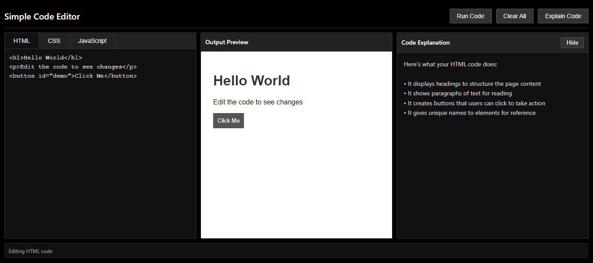

# 💻 Online Code Editor

🌐 **Live Demo:**  
👉 [Click Here to Try 🚀](https://mahnoorwaheed-dev.github.io/online-code-editor/)  

---

## 📸 Preview

  

---

## 🧾 Overview

**Online Code Editor** is a browser-based interactive coding environment that allows users to write and preview HTML, CSS, and JavaScript in real-time.

Inspired by modern developer tools, this project delivers a smooth and responsive interface for experimenting with frontend code directly in the browser.

---

## ✨ Key Features

### 🧑‍💻 Live Code Editing
- Write HTML, CSS, and JavaScript in separate panels  
- Instant output rendering  

### ⚡ Real-Time Preview
- See changes instantly without page reload  
- Fast and smooth execution  

### 🧩 Multi-Language Support
- HTML for structure  
- CSS for styling  
- JavaScript for interactivity  

### 🖥️ Interactive UI
- Clean and developer-friendly layout  
- Organized editor panels  

### 🌗 Theme Support *(if added)*
- Light & Dark mode switching  

### 📱 Responsive Design
- Works across mobile, tablet, and desktop  

---

## 🛠️ Tech Stack

- HTML5  
- CSS3  
- JavaScript (Vanilla)  

---

## 🚀 How It Works

1. Write code in HTML, CSS, or JavaScript panels  
2. Changes are processed instantly  
3. Output is rendered in the preview section  
4. Experiment and test ideas in real-time  

---

## 🎯 Purpose

This project demonstrates:

- DOM Manipulation  
- Real-time rendering logic  
- UI/UX design for developer tools  
- JavaScript event handling  
- Responsive layout techniques  

---

## 📌 Future Improvements

- 💾 Save & Load Code  
- 🔗 Shareable Code Links  
- 🧠 Auto-suggestions / IntelliSense  
- 📂 File Upload Support  
- 🖱️ Drag & Resize Panels  

---

## 💡 Author

**Mahnoor Waheed**  
Frontend Developer 🚀
